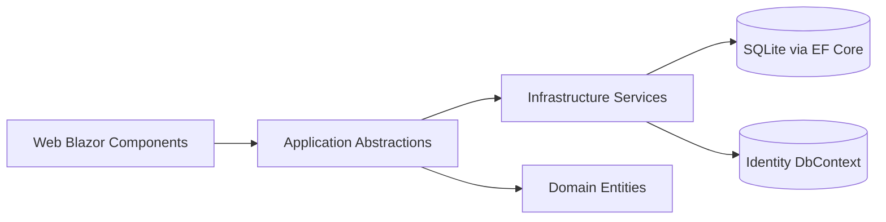

# Aunties Recipe

A production-style Blazor Web App portfolio project for a juice shop experience.  
The app demonstrates full-stack .NET delivery: customer ordering flows, admin operations, role-based access, EF Core persistence, CI quality gates, and Azure deployment automation.

## Highlights

- Blazor interactive web app (`.NET 9`)
- Clean layered structure:
  - `Domain`
  - `Application`
  - `Infrastructure`
  - `Web`
- Customer flow:
  - menu by category
  - cart and quantity management
  - checkout with configurable tax
  - order confirmation with daily token numbers
- Admin flow:
  - business profile and hero image management
  - category/item CRUD with local image uploads
  - order operations (`To Do`, `In Progress`, `Completed`)
  - order history filtering (name, phone, token, date range, status)
- CI/CD:
  - formatting, build, test, publish checks
  - GitHub Actions Azure App Service deployment

## Tech Stack

- ASP.NET Core / Blazor (`net9.0`)
- Entity Framework Core + SQLite
- ASP.NET Core Identity (roles + auth cookies)
- Bootstrap + custom CSS
- xUnit + FluentAssertions
- GitHub Actions + Azure App Service

## Architecture

Detailed notes are in `docs/architecture.md` and `docs/engineering-notes.md`.  
Architecture decisions are tracked in:
- `docs/adr/ADR-001-service-boundary-split.md`
- `docs/adr/ADR-002-sqlite-migrations-strategy.md`
- `docs/adr/ADR-003-auth-endpoint-flow.md`

## Local Setup

1. Install .NET SDK 9.
2. From repository root:
   - `dotnet restore`
   - `dotnet build`
   - `dotnet run --project src/AuntiesRecipe.Web/AuntiesRecipe.Web.csproj`
3. Open the printed localhost URL.

The app auto-migrates databases and seeds baseline menu/category data on startup.

## Default Demo Admin

Configurable in `src/AuntiesRecipe.Web/appsettings.json` under `AdminDefaults`.

- Username: `admin.net`
- Password: `admin.password`

For real deployments, set stronger values through environment-specific configuration.

## Quality Gate

Run before pushing:

- `dotnet format --verify-no-changes`
- `dotnet build -c Release`
- `dotnet test -c Release`
- `dotnet publish src/AuntiesRecipe.Web/AuntiesRecipe.Web.csproj -c Release -o ./artifacts/publish`

## Deployment

- `azure-webapp-deploy.yml` deploys to Azure App Service using publish profile secrets.
- `ci.yml` enforces format/build/test/publish checks.

Required GitHub secrets:

- `AZURE_WEBAPP_NAME`
- `AZURE_WEBAPP_PUBLISH_PROFILE`

## Security Notes

- Role checks protect admin pages and admin service actions.
- File uploads are validated for size, extension, MIME type, and image signature.
- Runtime-uploaded image folders are git-ignored to avoid leaking local artifacts.

## Observability Notes

- Structured logs are emitted for:
  - checkout start/completion with order/token metadata
  - admin order history query filters + page metadata
  - admin status update actions
  - auth login/logout outcomes (without sensitive payloads)

## Known Trade-Offs

- SQLite is used for easy local/dev portability.
- Admin defaults exist for demo speed and should be overridden in real environments.
